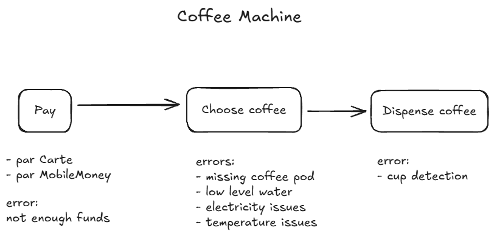

# Coffee Machine

## Overview

This project outlines a basic coffee vending machine logic. It includes user interaction through payment, coffee selection, and coffee delivery. The system also handles a set of operational errors and guides the user accordingly.

---

## Use Case

**Purpose:**  
The Coffee Machine allows users to purchase and receive a cup of coffee by following a simple three-step process:

1. **Pay**
2. **Choose coffee**
3. **Dispense coffee**

---

## Process Flow

### 1. Pay

The user initiates payment via:
- Card (Carte)
- Mobile Money

**Possible error:**
- Insufficient funds

### 2. Choose Coffee

User selects a coffee type.

**Possible errors:**
- Missing coffee pod  
- Low water level  
- Electricity issues  
- Temperature or pressure issues

### 3. Dispense Coffee

Machine attempts to dispense the coffee.

**Possible error:**
- Cup not detected

---

## Error Handling

| Stage      | Possible Errors                    |
|------------|------------------------------------|
| Payment    | Insufficient funds                 |
| Selection  | Missing coffee pod                 |
|            | Low water level                    |
|            | Electricity issues                 |
|            | Temperature/pressure issues        |
| Dispensing | Cup not detected                   |

---

## Flow


```text
Start -> [Pay]
    -> If payment successful
        -> [Choose coffee]
            -> If all system checks OK
                -> [Dispense coffee]
                    -> If cup detected -> Serve coffee
                    -> Else -> Show "Place cup"
            -> Else -> Show specific error
    -> Else -> Show "Insufficient funds"
```